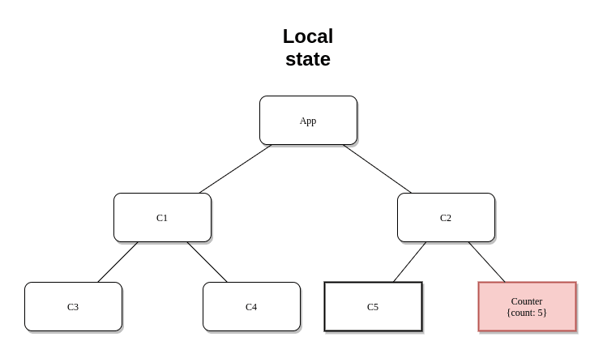
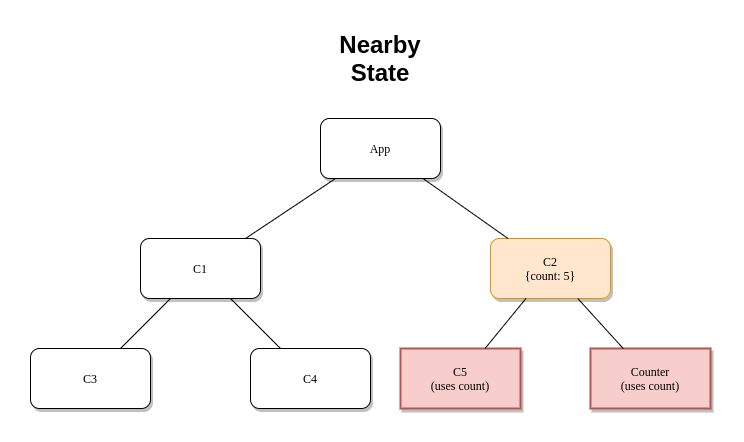
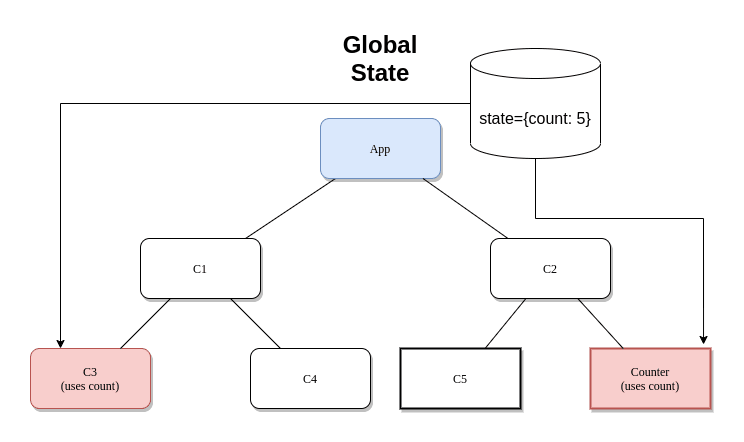

### What is State?

I’ll like to talk about how to understand state in a way that helps you make more informed decisions about managing it.

> **State in reactive programming is data that dictates the configuration of the application in any moment in time.**

In simpler words, any part of the application that is subject to change has some associated data that changes it; that data is called a state. Now, this is where people stop, learn about state, and then after learning redux put everything inside redux global state. In order to understand how to better manage state, we need to know how many types of state there can be. I like to classify state in two ways and then choose the technologies that are best suited for managing those kinds of state.

### Classification based on origin

Wherefrom the state originates is an important thing to consider and can be classified into:

**Client-side state:** Any data that is generated and consumed on the client-side like UI state can be put into this category. The general rule of thumb while managing this sort of state is to see how far the components consuming it are in the component tree. We will talk about this sort of classification a bit later. A good practice to follow if you are unsure of managing this is start with local state and you if other components need it too, you can start lifting the state up the tree. **Note: Never put UI state in the cache.**

**Server-side state: **This is not be confused by the state that is managed between the server and the database. This state is essentially any data that is requested by the client from the server via REST/GraphQL APIs. This kind of data is not originated in the client and hence requires special treatment. We would not like to re-fetch this data from the server continuously and would like to cache it. Now if you are an expert you can certainly do it yourself with Redux/Mobx/Recoil and your own caching mechanism. But there are libraries out there that are better suited for this job, like ReactQuery/SWR if you are using REST, or Apollo if you are using GraphQL. These libraries are specialized to handle these kinds of state and optimally caches it.

### Classification based on distance

Now, this is something every developer at some point and another makes a mistake in. I too was guilty in putting everything in the global state. It’ll create unnecessary files, folder and boilerplate for simple things like updating a counter that is used in a single component. *You’ll generally want to keep the data close to where you are consuming it. *Now that we all agree redux is bad (JK :P) let’s move on to classifying it.

#### Local State

This will be the state that you’ll need and use the most. It’s generally the state that is required by one component and is very easy to handle.



Here we have the Counter component using a count state variable whose value is 5. In order to update/change the value, we’ll use two methods; one using the useState hook and another using useReducer.

> Note: We will be using Typescript for the demos

**Example using useState:**

> Link to code in the playground: [click here](https://codesandbox.io/s/react-state-management-825bv?file=/src/UseState.tsx)

    import React, { useState } from "react";

    const Counter: React.FC = () => {
      const [count, setCount] = useState<number>(0);
      return (
        <div>
          <div>Count: {count}</div>
          <button onClick={() => setCount(count + 1)}>+</button>
          <button onClick={() => setCount(count - 1)}>-</button>
        </div>
      );
    };

    export default Counter;

The useState hook provides us with a state variable and a callback to update the state. We can use the `count` variable like a normal variable and the `setCount()` callback when called with a new value of the count, reflects the update in all the places the variable `count` is used.

**Example using useReducer:**

> Link to code in the playground: [click here](https://codesandbox.io/s/react-state-management-825bv?file=/src/UseReducer.tsx)

    import React, { useReducer } from "react";

    type State = {
      count: number;
    };
    type Action = { type: "increment" } | { type: "decrement" };
    type Reducer = (state: State, action: Action) => State;

    const initialState: State = { count: 0 };

    const reducer: Reducer = (state, action) => {
      switch (action.type) {
        case "increment":
          return { count: state.count + 1 };
        case "decrement":
          return { count: state.count - 1 };
        default:
          throw new Error();
      }
    };

    const Counter: React.FC = () => {
      const [state, dispatch] = useReducer(reducer, initialState);
      return (
        <div>
          <div>Count: {state.count}</div>
          <button onClick={() => dispatch({ type: "decrement" })}>-</button>
          <button onClick={() => dispatch({ type: "increment" })}>+</button>
        </div>
      );
    };
    export default Counter;

I’ll not go into the details of the Flux architecture and Redux concepts (that’s a topic for another time) but as you can see useReducer follows the redux pattern and exposes a more fine-grain control of how the state is updated. You can easily interchange useState and useReducer and in most cases, my local state doesn’t get so complicated and I end up using useState.

The basic difference here is you call the useReducer hook with a reducer function, that accepts the state and different actions, and also an initial state. You could have optionally passed in an initializer function for lazy initialization of the initial state. The hook returns you with the state variable and a dispatch method, unlike useState which return a setState callback. You can then dispatch the type of action depending on your need and the reducer function will execute the corresponding portion of the switch case to update your state.


#### State used by nearby components

Sometimes two or more nearby components requires the same state variable and the action you should take to manage that kind of state is to look at how far apart are they in the component tree.



<span class="figcaption_hack">
  The state variable is in the yellow component and is passed down to the red
  ones
</span>

If the components using the state is nearby in the component tree like the above image, the simplest thing to do is to lift the state up to the component that is the parent to both of them. In this case, C2 is the first common parent of C5 and Counter. I generally do this only if the parent is one level above the children. But if the state is passed multiple levels deep, a lot of components will we just used for passing the state down the tree and without consuming it. This is called a prop drilling problem. An example would be:

**Example of prop passing:**

> Link to code in the playground: [click here](https://codesandbox.io/s/react-state-management-825bv?file=/src/PassingProps.tsx)

    import React, { useState } from "react";

    const CounterContainer: React.FC = () => {
      const [count, setCount] = useState<number>(0);
      return <CounterMiddle count={count} setCount={setCount} />;
    };

    interface ICounter {
      count: number;
      setCount: React.Dispatch<React.SetStateAction<number>>;
    }

    const CounterMiddle: React.FC<ICounter> = ({ count, setCount }) => {
      return (
        <div>
          <p>I am a middle layer</p>
          <Counter count={count} setCount={setCount} />
        </div>
      );
    };

    const Counter: React.FC<ICounter> = ({ count, setCount }) => {
      return (
        <div>
          <div>Count: {count}</div>
          <button onClick={() => setCount(count + 1)}>+</button>
          <button onClick={() => setCount(count - 1)}>-</button>
        </div>
      );
    };

    export default CounterContainer;

Here we are using useState to keep the state in the parent `CounterContainer` component and passing the state and the callback down the tree to the `Counter`. The problem here is that the `CounterMiddle` doesn’t use the state and is used for just passing down the props to `Counter.`

To solve this issue people start using global state and with the growth of the project, you have 30–40 redux files just managing state that goes only 2–3 levels down the tree. A better solution would be to use a technique called composition. Let’s look at what it is.

**Example using composition:**

> Link to code in the playground: [click here](https://codesandbox.io/s/react-state-management-825bv?file=/src/Composition.tsx)

    import React, { useState } from "react";

    const CounterContainer: React.FC = () => {
      const [count, setCount] = useState<number>(0);
      return (
        <CounterMiddle>
          <Counter count={count} setCount={setCount} />
        </CounterMiddle>
      );
    };

    interface ICounterMiddle {
      children: React.ReactNode;
    }

    const CounterMiddle: React.FC<ICounterMiddle> = (props) => {
      return (
        <div>
          <p>I am a middle layer</p>
          {props.children}
        </div>
      );
    };

    interface ICounter {
      count: number;
      setCount: React.Dispatch<React.SetStateAction<number>>;
    }

    const Counter: React.FC<ICounter> = ({ count, setCount }) => {
      return (
        <div>
          <div>Count: {count}</div>
          <button onClick={() => setCount(count + 1)}>+</button>
          <button onClick={() => setCount(count - 1)}>-</button>
        </div>
      );
    };

    export default CounterContainer;

Here we apply a very simple yet neat trick and that is using the children props of a component. Observe that the `CounterMiddle` has nothing to do with the `Counter` and all its actual state are passed from the `CounterContainer.` We can now make the `CounterMiddle` take the `Counter` as `children` from the `CounterContainer` itself and this will allow us to pass the props directly to the `Counter` component. This sort of composition can help you avoid two to three levels deep prop drilling problem, while also providing a better architectured React application and cleaner code.

#### Global State

Now I believe, truly global state that is used by almost every component is rare and most use cases consist of components using the same piece of the state and are far apart in the component tree. An example of such tate might be a button in the header toggling a sidebar/menu and an example of truly global state might be theme change in the entire website from dark to light.



In the above case, the count state is used by both C3 and Counter and they are situated far apart in the component tree. To manage these sort of state you can use various state management libraries like Redux/MobX/Recoil but if you notice through this article we are classifying the states and using the appropriate tools for managing them, so at the end when we reach to the global state, this might be only 10–15% of the entire state of the application.

So if your application is not going to generate huge amounts of global state you can manage this using React Context API. Using Context is very simple, you’ll need to declare a context with an initial state value and use a Provider to provide the state in whichever part of the tree you see fit (yes it doesn’t need to always be truly global). Now all you need to do is consume the state in the components that need them.

**Example using Context API:**

> Link to code in the playground: [click here](https://codesandbox.io/s/react-state-management-825bv?file=/src/Context.tsx)

```
import React, { useState, createContext, useContext } from "react";
interface ICounter {
  count: number;
  setCount: React.Dispatch<React.SetStateAction<number>>;
}
const CountContext = createContext<ICounter>({ count: 0, setCount: () => {} });
const CounterContainer: React.FC = () => {
  const [count, setCount] = useState<number>(0);
  const initValue = { count: count, setCount: setCount };
  return (
    <CountContext.Provider value={initValue}>
      <CounterMiddle />
    </CountContext.Provider>
  );
};
const CounterMiddle: React.FC = () => {
  return (
    <div>
      <p>I am a middle layer</p>
      <Counter />
    </div>
  );
};
const Counter: React.FC = () => {
  const { count, setCount } = useContext<ICounter>(CountContext);
  return (
    <div>
      <div>Count: {count}</div>
      <button onClick={() => setCount(count + 1)}>+</button>
      <button onClick={() => setCount(count - 1)}>-</button>
    </div>
  );
};
export default CounterContainer;
```

Here we declare a context called `CounterContext` that takes a `count` and a `setCount` and we’ll be using useState to manage the actual state changing.

> Note: Default value is not the same as initial value. The default is used as a fallback.

We pass an initial value to the `CounterContext.Provider` and wrap it around `CounterContainer` so that all children of that component can access the state. The state will not be accessible outside the scope of the provider, which is exactly what we want.

Now, all we have to do is get the state and the callback using an useContext hook from React and use and change the state the same way we used useState.

Now that we have learned a lot about managing state, here’s a bonus section for you.

### Bonus with GraphQL

The landscape of state management changes when we enter graphQL. If you are using libraries like Apollo to manage your GraphQL state you can replace everything with Apollo equivalents.>> The server cache is maintained by Apollo
InMemory cache,<br /> the local state can be maintained by Apollo’s reactive vars,<br /> and finally, the global state too can be maintained in a lot of ways, one such being attaching a client directive to your Queries and Mutations.

But that being said I still prefer using React’s own solution for state management most of the time, at least for local state.

### Conclusion

State Management in React can be a sticky affair, but I hope that I could explain the essence of classifying state in your React application. To summarise our discussion:

> If you can understand which kind of state is it, you can apply the right tool for the job.<br /> If you can understand who uses the state, you can put it in the
> appropriate position in the tree and architecture your components in a better
> way.


**Examples from real projects:**

Now if you have come this far and is interested to see these applied in a real project that is under development, check this out:<br />
[https://github.com/litmuschaos/litmus/tree/litmus-portal/litmus-portal/frontend/src](https://github.com/litmuschaos/litmus/tree/litmus-portal/litmus-portal/frontend/src)

The tech stack consists of Typescript, Apollo and Redux. Here we use Redux because we do have a lot of global states and the amazing developer tooling that Redux provides.
You can study the code, suggest improvements or open a discussion in **[Slack](http://slack.litmuschaos.io)** (We have a #litmus channel under Kubernetes slack). I'm a developer contributing in Litmus and I'll try my best to answer your queries and explain why these technologies are being used and if you like the project, you can leave us a **[star](https://github.com/litmuschaos/litmus)**.

You can find me on Twitter **[here](https://twitter.com/guywithpajamas)**.<br /> If you are more of a LinkedIn person, catch me **[here](https://www.linkedin.com/in/arkajyotimukherjee/)**.<br /> Or if Github is your thing, I’m **[there](https://github.com/arkajyotiMukherjee)** too.

Feel free to contact me if you have a problem with React, Web development in general or just hit me up with a cat gif if that’s your thing. I’m no expert but I’ll try my best to help you. Thanks for sticking for so long, here's a catato.

Adios ❤


